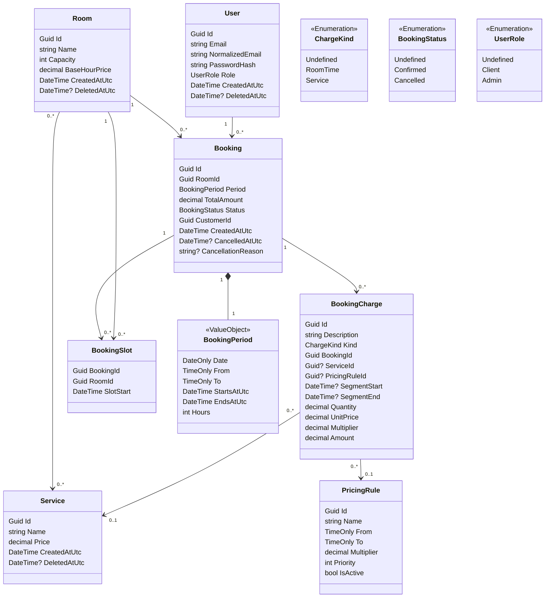

# RoomRental

API для управления арендой конференц-залов: справочник залов и услуг, подбор свободных залов
на нужное время, бронирование с расчётом стоимости и отчёты для бизнеса.

Тестовое задание. .NET 10, PostgreSQL, Entity Framework Core.

---

## Быстрый старт

Нужен только Docker. Ни .NET SDK, ни PostgreSQL ставить не требуется.

```bash
cp .env.example .env
docker compose up
```

Swagger UI: <http://localhost:8080/swagger>

База поднимается сама, миграции накатываются на старте, начальные данные из ТЗ
(три зала, три услуги, четыре правила ценообразования) создаются автоматически.

**Администратор:** `admin@roomrental.local` / `local-admin-password` - значения из `.env.example`.
Регистрация через API всегда создаёт обычного клиента, поэтому админа берём отсюда.

### Что посмотреть за пять минут

1. `POST /api/auth/login` под администратором. Скопировать токен, нажать **Authorize**
   в правом верхнем углу Swagger и вставить его.
2. `GET /api/rooms/available` - подбор свободных залов. Поля уже заполнены примерами:
   достаточно подставить дату в будущем, `From=11:00`, `To=14:00`, `Capacity=50`.
3. `POST /api/auth/register` с любым email, затем вход под ним. Дальше
   `POST /api/bookings` на Зал А, те же 11:00-14:00, с услугой «Проектор».
   В ответе видно, из чего сложились 7100: 2000 за стандартный час,
   4600 за два пиковых с наценкой 15%, 500 за проектор.
4. Повторить шаг 2 - Зал А из выдачи исчез, часы заняты.
5. Снова под администратором: `GET /api/reports/pricing-rules` - сколько часов продано
   по каждому правилу и сколько на нём отдано скидкой или заработано наценкой.

Остановить и удалить данные: `docker compose down -v`

---

## Содержание

- [Быстрый старт](#быстрый-старт)
- [Бизнес-задача](#бизнес-задача)
- [Запуск](#запуск)
- [Начальные данные](#начальные-данные)
- [Расчёт стоимости аренды](#расчёт-стоимости-аренды)
- [Методы API](#методы-api)
- [Отчёты](#отчёты)
- [Архитектура](#архитектура)
- [Модель предметной области](#модель-предметной-области)
- [Технические решения](#технические-решения)
- [Безопасность](#безопасность)
- [Тесты](#тесты)
- [Что осталось за рамками](#что-осталось-за-рамками)

---

## Бизнес-задача

Компания сдаёт в аренду конференц-залы. Клиенту нужно найти свободный зал на определённые дату
и время, заказать дополнительные услуги и узнать итоговую стоимость. Компании нужно управлять
залами и прайсом, а также понимать, какие залы простаивают и окупается ли скидочная политика.

Стоимость аренды зависит от времени суток: утренние и вечерние часы дешевле, пиковые дороже.
Услуги оплачиваются отдельно и фиксированной суммой за бронь.

---

## Запуск

При старте приложение само применяет миграции и наполняет пустую базу начальными данными,
поэтому отдельных шагов не требуется.

### В Docker

Команды - в разделе [Быстрый старт](#быстрый-старт). Здесь подробности о том, как это устроено.

Поднимаются два контейнера: PostgreSQL и API. База ждёт готовности по `pg_isready`,
и только после этого стартует приложение - иначе миграции упёрлись бы в незапущенный сервер.
Данные лежат в именованном томе и переживают перезапуск контейнеров. Наружу PostgreSQL
отдан на порт **5433**, чтобы не конфликтовать с локально установленным.

Настройки читаются из `.env`, который не попадает в репозиторий. В `.env.example` лежат
значения для локального запуска: их достаточно, чтобы всё заработало, но для чего-то
серьёзного их нужно заменить.

### Локально

Нужен установленный PostgreSQL. Строка подключения задаётся
в `ConnectionStrings:DefaultConnection`.

```bash
dotnet run --project src/Infrastructure/API/RoomRental
```

Секреты в репозитории не хранятся, поэтому перед первым запуском:

```bash
cd src/Infrastructure/API/RoomRental
dotnet user-secrets set "ConnectionStrings:DefaultConnection" "Host=localhost;Port=5432;Database=room_rental;Username=postgres;Password=<пароль>"
dotnet user-secrets set "Jwt:Key" "<ключ не короче 32 символов>"
dotnet user-secrets set "Seed:AdminPassword" "<пароль администратора>"
```

Приложение не стартует, если `Jwt:Key` не задан или короче 32 символов: настройки проверяются
на старте, а не при первом обращении.

Наполнение базы отключается флагом `Seed:Enabled`. В `appsettings.json` он выключен,
в `appsettings.Development.json` и в Docker включён.

### Тесты

```bash
dotnet test
```

---

## Начальные данные

Создаются автоматически при первом запуске на пустой базе. Каждый набор проверяется отдельно,
поэтому повторный запуск ничего не дублирует, а частично заполненная база достраивается.

| Зал   | Вместимость | Базовая цена за час |
|-------|-------------|---------------------|
| Зал А | 50          | 2000                |
| Зал B | 100         | 3500                |
| Зал C | 30          | 1500                |

| Услуга   | Цена |
|----------|------|
| Проектор | 500  |
| Wi-Fi    | 300  |
| Звук     | 700  |

Плюс администратор с логином и паролем из секции `Seed` и четыре правила ценообразования.

---

## Расчёт стоимости аренды

Бронировать можно **с 06:00 до 23:00, по целым часам, в пределах одних суток**.

| Правило          | Часы        | Множитель | Приоритет |
|------------------|-------------|-----------|-----------|
| Утренние часы    | 06:00-09:00 | 0.90      | 10        |
| Стандартные часы | 09:00-18:00 | 1.00      | 10        |
| Пиковые часы     | 12:00-14:00 | 1.15      | 20        |
| Вечерние часы    | 18:00-23:00 | 0.80      | 10        |

Пиковые часы лежат **внутри** стандартных, поэтому у правил есть приоритет: на каждый час
выбирается активное правило с наибольшим приоритетом. Границы полуоткрытые (`>= From`, `< To`),
так что 18:00 относится к вечерним часам, а не к стандартным.

Период брони режется на часы, соседние часы с одним правилом склеиваются в один отрезок,
и на каждый отрезок создаётся строка расчёта. Услуги добавляются отдельными строками
с количеством 1.

### Пример

Зал А, 11:00-14:00, с проектором:

```
11:00-12:00  Стандартные часы   1 ч × 2000 × 1.00 = 2000
12:00-14:00  Пиковые часы       2 ч × 2000 × 1.15 = 4600
услуга       Проектор           1   ×  500 × 1    =  500
                                            ИТОГО   7100
```

Ответ `POST /api/bookings` содержит и итог, и эту разбивку целиком - клиент видит,
из чего сложилась цена.

Если на какой-то час не заведено ни одного правила, он тарифицируется по базовой ставке
без множителя.

---

## Методы API

Полное описание с примерами - в Swagger UI. Права: «все» - без токена,
«вошедший» - любой авторизованный, «Admin» - только администратор.

### Аутентификация

| Метод | Путь                 | Права |
|-------|----------------------|-------|
| POST  | `/api/auth/register` | все   |
| POST  | `/api/auth/login`    | все   |

Регистрация всегда создаёт клиента. Вход возвращает JWT, который передаётся
в заголовке `Authorization: Bearer {token}`.

### Залы

| Метод  | Путь                                        | Права |
|--------|---------------------------------------------|-------|
| GET    | `/api/rooms`                                | все   |
| GET    | `/api/rooms/{id}`                           | все   |
| GET    | `/api/rooms/available`                      | все   |
| POST   | `/api/rooms`                                | Admin |
| PUT    | `/api/rooms/{id}`                           | Admin |
| DELETE | `/api/rooms/{id}`                           | Admin |
| POST   | `/api/rooms/{id}/services/{serviceId}`      | Admin |
| DELETE | `/api/rooms/{id}/services/{serviceId}`      | Admin |

`GET /api/rooms/available` - метод подбора из ТЗ: принимает дату, время «от» и «до»
и минимальную вместимость, возвращает залы, свободные на **весь** период.

### Услуги

| Метод  | Путь                 | Права |
|--------|----------------------|-------|
| GET    | `/api/services`      | все   |
| GET    | `/api/services/{id}` | все   |
| POST   | `/api/services`      | Admin |
| PUT    | `/api/services/{id}` | Admin |
| DELETE | `/api/services/{id}` | Admin |

### Бронирование

| Метод | Путь                        | Права            |
|-------|-----------------------------|------------------|
| POST  | `/api/bookings`             | вошедший         |
| GET   | `/api/bookings/{id}`        | владелец / Admin |
| POST  | `/api/bookings/{id}/cancel` | владелец / Admin |

Клиент определяется по токену - передавать его идентификатор в теле запроса не нужно
и невозможно. Чужую бронь нельзя ни посмотреть, ни отменить: проверка владельца выполняется
после загрузки брони, потому что зависит от её данных, а не только от роли.

### Отчёты

| Метод | Путь                            | Права |
|-------|---------------------------------|-------|
| GET   | `/api/reports/revenue`          | Admin |
| GET   | `/api/reports/room-utilization` | Admin |
| GET   | `/api/reports/pricing-rules`    | Admin |

### Коды ответов

| Код | Когда                                                              |
|-----|--------------------------------------------------------------------|
| 400 | не прошла валидация запроса или нарушено правило домена            |
| 401 | нет токена или он недействителен                                   |
| 403 | роли не хватает либо объект принадлежит другому пользователю       |
| 404 | сущность не найдена                                                |
| 409 | зал уже занят, email уже занят, бронь уже началась                 |

Ошибки возвращаются в формате `ProblemDetails`. Исключения домена и слоя приложения
переводятся в коды одним обработчиком, наружу уходит только текст сообщения.

---

## Отчёты

ТЗ просит придумать отчёты, полезные бизнесу. Сделаны три.

**Выручка за период** (`/api/reports/revenue`) - итог с разбивкой на аренду и услуги,
разрезы по залам и по услугам. Отвечает на вопрос «сколько заработали и на чём».

**Загрузка залов** (`/api/reports/room-utilization`) - сколько часов из доступных выкуплено
по каждому залу. Знаменатель - количество суток в периоде × 17 часов окна бронирования,
поэтому ночные часы загрузку не занижают. Отвечает на вопрос «какие залы простаивают».

**Эффективность правил ценообразования** (`/api/reports/pricing-rules`) - сколько часов продано
по каждому правилу, сколько эти часы стоили бы по базовой ставке и сколько стоили фактически.
Отрицательная разница - отдано скидкой, положительная - заработано наценкой.

Третий отчёт замыкает петлю обратной связи: правила ценообразования - сердце системы,
и он показывает, окупаются ли вечерние скидки и оправдана ли пиковая наценка.
Пример из тестового прогона: скидки за период отдали 1600, наценка вернула 600,
то есть скидочная политика обошлась в 1000.

Во всех отчётах учитываются только подтверждённые брони.

---

## Архитектура

Четыре слоя, зависимости направлены внутрь: инфраструктура знает о приложении,
приложение - о домене, домен не знает ни о ком.

```
src/
  Domain              сущности, value object, доменный сервис расчёта.
                      Без зависимостей, кроме Ardalis.GuardClauses

  Application         Abstraction: команды, запросы, DTO, интерфейсы репозиториев
                      UseCases:    обработчики MediatR, тонкие, без бизнес-логики

  Infrastructure      Dal:            DbContext, конфигурации EF, миграции
                      Infrastructure: реализации репозиториев, BCrypt, JWT, наполнение базы
                      API:            контроллеры, контракты, маппинг, обработка ошибок

  Tests               юнит-тесты домена
```

Бизнес-правила живут в домене. Обработчик команды только собирает данные, отдаёт их доменной
модели и сохраняет результат - например, `CreateBookingCase` не считает стоимость сам,
это делает `Booking.Create`.

`Contracts` - единственный проект без зависимостей: он описывает публичный контракт API
и намеренно не ссылается на домен, чтобы изменение внутреннего правила не превращалось
в незаметное изменение контракта.

---

## Модель предметной области



Две сущности в этой схеме выглядят избыточными, но решают конкретные задачи -
`BookingSlot` и `BookingCharge`. Об этом ниже.

---

## Технические решения

### BookingSlot: защита от двойного бронирования

Бронь дополнительно раскладывается на часовые слоты, а первичный ключ таблицы -
пара `(room_id, slot_start)`.

Проверка «свободен ли зал» запросом перед вставкой не спасает от гонки: два одновременных
запроса оба увидят зал свободным и оба создадут бронь. Проверка есть - она нужна, чтобы
вернуть внятную 409 в обычном случае, - но настоящую гарантию даёт первичный ключ:
вторая вставка физически не пройдёт.

При отмене слоты удаляются, и часы возвращаются в продажу. Строки расчёта при этом
сохраняются: они нужны для истории и отчётов.

### BookingCharge: снимок цены

Строка расчёта хранит не ссылку на цену, а её копию: количество, цену за единицу
и множитель правила на момент бронирования.

Иначе изменение прайса задним числом переписало бы стоимость уже оплаченных броней.
Побочный выигрыш - детализация: клиент видит, что 7100 это 2000 + 4600 + 500, а не просто число.

### BookingPeriod: сутки гарантируются типом

Период брони - value object из `DateOnly` + двух `TimeOnly`, а не два произвольных `DateTime`.
Это ровно та форма, в которой вход описан в ТЗ.

Такой тип делает невыразимыми целые классы ошибок: бронь не может пересечь полночь, потому что
обе границы строятся из одной даты; не может иметь неверный `DateTimeKind`, потому что UTC
собирается внутри; не может длиться дольше суток. Это не проверки - этого просто нельзя написать.

Поиск свободных залов принимает тот же период, поэтому он не может предложить время,
которое потом не удастся забронировать.

### Мягкое удаление

Залы, услуги и пользователи не удаляются физически: проставляется `DeletedAtUtc`.
Иначе удаление зала унесло бы за собой историю броней и выручку из отчётов.
Внешние ключи на справочники стоят с `Restrict` - на случай, если кто-то попробует
удалить строку в обход домена.

### Отслеживание сущностей

Репозитории читают данные без отслеживания (`AsNoTracking`) и отдают отдельный метод
`GetForUpdateAsync` там, где сущность будут менять.

Разделение не косметическое. Отмена брони удаляет слоты, а изменение состава услуг зала -
строки связующей таблицы. Оба действия видны Entity Framework только при отслеживании:
на отсоединённом графе он не с чем сравнивать и просто не заметит удалённое.

### Перечисления строками

`status`, `kind` и `role` хранятся в базе текстом. Цена решения - переименование элемента
перечисления требует миграции с `UPDATE`. Выигрыш - в базу можно заглянуть и понять данные
без обращения к коду.

### Прочее

- Идентификаторы - `Guid` версии 7: случайные, но упорядоченные по времени,
  что лучше для индексов, чем полностью случайный `Guid`.
- Суммы - `numeric(12,2)`, множители - `numeric(6,4)`. Точность задана явно,
  а не оставлена на усмотрение провайдера.
- Отчёты опираются на индекс `(status, date)` на таблице броней.
  Он создан вручную в миграции: EF не умеет строить индексы по свойствам комплексного типа.

---

## Безопасность

- Пароли хранятся хешами BCrypt с фактором 12. Соль случайная и лежит внутри хеша.
- Доступ по JWT. Роли: `Client` и `Admin`. Регистрация всегда даёт `Client`,
  администратор создаётся при наполнении базы.
- Идентификатор клиента при бронировании берётся из токена, а не из тела запроса.
- Свои брони видит и отменяет только их владелец либо администратор.
- Постраничные выборки ограничены сверху (100 записей), период отчёта - санитарной границей,
  чтобы запрос не мог заставить базу читать всё подряд.
- Вход не уточняет, что именно неверно - email или пароль.
- Секреты не хранятся в репозитории, настройки проверяются при старте приложения.

---

## Тесты

41 юнит-тест на домен: расчёт стоимости, период бронирования, создание и отмена брони.

Покрыт именно домен, потому что это единственное место с нетривиальной логикой.
Остальные слои - передача данных между границами, и тесты на них при таком объёме
дали бы меньше, чем стоили.

Что проверяется: четыре сценария расчёта из ТЗ, склейка соседних часов с одним правилом,
приоритет пересекающихся правил, полуоткрытые границы, часы без правила, границы окна
бронирования, целые часы, бронь в прошлом, состав услуг, снимок цены, освобождение слотов
при отмене и сохранение расчёта при ней же.

---

## Что осталось за рамками

Сознательные упрощения, а не забытое:

- **Refresh-токены.** Access живёт час, дальше нужен повторный вход.
- **Нерабочие дни.** Загрузка залов считает все календарные дни; если зал по воскресеньям
  не работает, показатель занижен.
- **Отчёт по отменам.** Причина отмены - свободный текст, осмысленного разреза по ней
  не построить.
- **Гонки на уникальных индексах** возвращают 500, а не 409: нарушение уникальности
  на уровне базы не переводится в доменное исключение. Обычный путь при этом закрыт
  проверками и отдаёт 409 корректно.
